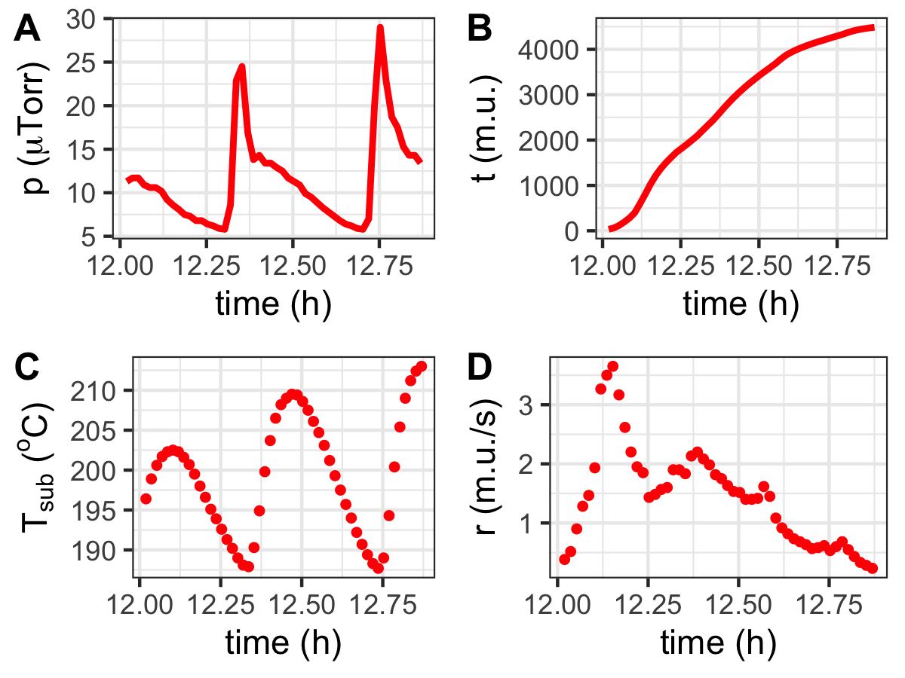
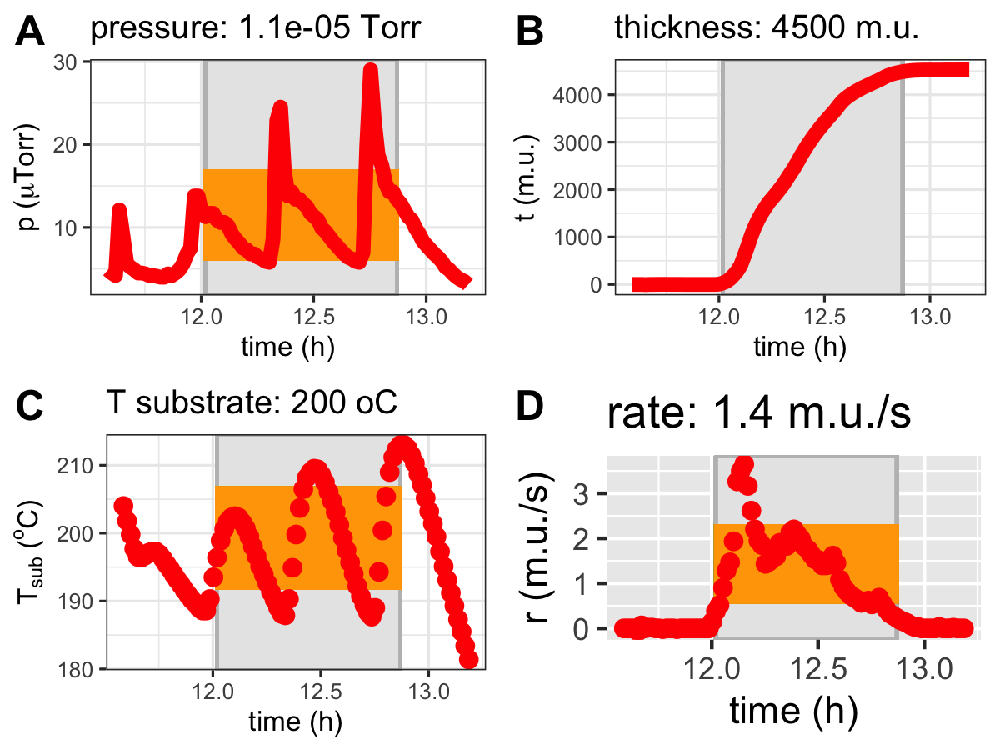

# NTE-Deposition-Parameters

Graph and analyze the NTE 3000 deposition parameters.

## NTE.load

loads the text file that contains time, pressure, temperatures from the NTE and returns a data.frame

## NTE.plotSummary

Creates a Quad Graph with all information:

```R
d = NTE.load(file.list[3])
g1 = NTE.plotSummary(d, sz=1)
print(g1)
```


## NTE.depStartEnd

Zooming in on the relevant positions and finding the approximate starting and ending times of the deposition. It is also possible to compute the average relevant parameters.

```R
d2 = NTE.depStartEnd(d)
g2 = NTE.plotSummary(d2, sz=1)
print(g2)
```



Average parameters can be found as follows:

```R
summary(d2)
NTE.getParams(d)
```


## NTE.plotDeposition

Here is an example that shows the relevant portions of the deposition with 0.8 (or 80%) of time scale on the left and right:

```R
g3 = NTE.plotDeposition(d,0.8)
print(g3)
```


